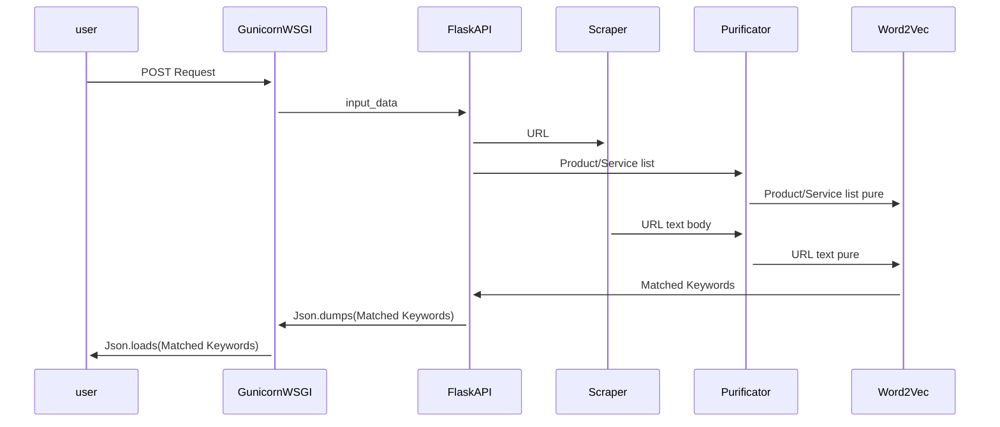

# Web2Keyword
Extract Most Relevant Keywords from Webpage to the given list of sentences or words.

## Sequence Diagram


## GunicornWSGI
Gunicorn Web Service Gateway Interface runs Flask application API production friendly

## FlaskAPI
Generates RESTfulAPI application via Flask package ready for Client/Server requests through POST/GET methods.

## Scraper
Publish crawling spiders to capture URL text body via Selenium automation and Chrome/Firefox latest Web Drivers in order to generate most accurate rendering of all human readable text body of input URL Webpage.
 
## Purificator
Performing text cleaning, removing Eng stop words and also double check existance of word in NLP model vocabulary corpus. 

## Word2Vec
Runs Pre-Trained Google Word2Vec NLP model in order to convert word space to vector space and perform Similarity comparision of cross referenced input text corpus.

# FAQ
## How to install and use
First of all, clone Web2Keyword repository on your system
```bash
$ git clone https://gitlab.com/remirab/Web2Keyword.git
```
and then change into package root directory
```bash
$ cd /path/to/Word2Vec
```
Initialize the package with bash script `initializer.sh`. Make it executable and then run. Please pay attention that this initializer needs `sudo` privileges for some parts to perform correctly. You can take look at the script contents in the root path of the package. Considering [GenSim](https://pypi.org/project/gensim/) usage as core engine and [Word2Vec](https://en.wikipedia.org/wiki/Word2vec) as vocabulary corpus of all models, downloading approximately 1.8 GB will happen at the end of initializer. You can skip this step, but with first package startup, the download process will run automatically. 
```bash
$ chmod +x initializer.sh
$ ./initializer.sh
```
