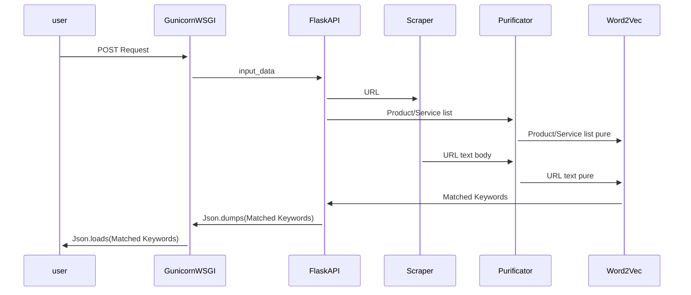

# Web2Keyword
Extract Most Relevant Keywords from Webpage to the given list of sentences or words.

## Sequence Diagram

## GunicornWSGI
Gunicorn Web Service Gateway Interface runs Flask application API production friendly

## FlaskAPI
Generates RESTfulAPI application via Flask package ready for Client/Server requests through POST/GET methods.

## Scraper
Publish crawling spiders to capture URL text body via Selenium automation and Chrome/Firefox latest Web Drivers in order to generate most accurate rendering of all human readable text body of input URL Webpage.
 
## Purificator
Performing text cleaning, removing Eng stop words and also double check existance of word in NLP model vocabulary corpus. 

## Word2Vec
Runs Pre-Trained Google Word2Vec NLP model in order to convert word space to vector space and perform Similarity comparision of cross referenced input text corpus.

# FAQ
## How do I install and use a package?
First of all, you need to clone Web2Keyword repository of your system .

