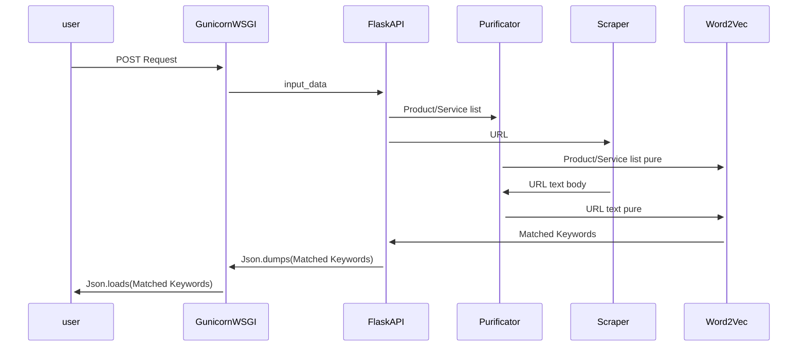

# Web2Keyword
Extract Most Relevant Keywords from Webpage to the given list of sentences or words..

## Sequence Diagram


## GunicornWSGI
[Gunicorn](https://gunicorn.org/) Web Service Gateway Interface runs Flask application API production friendly. The Gunicorn server is broadly compatible with a number of web frameworks, simply implemented, light on server resources and fairly fast.

## FlaskAPI
Generates RESTfulAPI application via [Flask](https://en.wikipedia.org/wiki/Flask_(web_framework)) package ready for Client/Server requests through POST/GET methods. To name a few of its feature:
* Development server and debugger
* Integrated support for unit testing
* RESTful request dispatching

## Crawler
Publish crawling web spiders to capture URL text body via [Selenium](https://www.selenium.dev/) automation and Chrome/Firefox latest Web Drivers in order to generate most accurate rendering of all human readable text body of input URL Webpage.
#### Liberaries
+ **Selenium:** great rendering of static and dynamic pages with the capability to generate dedicated contex-aware scrapers for specific websites. 
+ **BeautifulSoup:** powerful yet simple featureful HTML parser.
### important Methods
- **Crawler.spider()**
- **Crawler.raw_body_extractor()**
 
## Purificator
Performing text cleaning, with removing English stop words. Also it will double check existence of each word in NLP model vocabulary corpus.
### Important Methods
- **Purificator.text_cleaner()**
- **Purificator.non_vocab_cleaner()**

## Word2Vec
Runs pre-Trained [Google Word2Vec](https://code.google.com/archive/p/word2vec/) NLP model in order to convert word-space to vector-space and perform super fast Similarity comparision on huge cross-referenced input_text and url_contents corpus.
### Liberaries
+ **GenSim:** One of the most well-known professionally-crafted `Natural Language Processing` liberaries with excellent reference API. [GenSim](https://radimrehurek.com/gensim/) is my faivorate, but in future improvements I will experiment [TensorFlow](https://www.tensorflow.org/) implementation of Word2Vec model as well. 
### important Methods
- **Word2Vec.similarity()**
- **Word2Vec.most_similar()**

# FAQ
## How to install
First of all, clone Web2Keyword repository on your system
```bash
$ git clone https://gitlab.com/remirab/Web2Keyword.git
```
and then change into package root directory
```bash
$ cd /path/to/Word2Vec
```
**Important: Please install latest version of FireFox borwser (driver>=0.29.0)**. The `Scraper` module uses Firefox [geckodriver](https://github.com/mozilla/geckodriver) to artificially renders full webpage regarding JavaScript objects that rendered server-side, not inside static HTMLs pages. For future improvements I considered to use `PhantomJS headless driver` that hopefully overcomes this issue.
```bash
$ sudo apt install firefox
```
Initialize the package with bash script `initializer.sh`. Make it executable and then run. Please pay attention that this initializer needs `sudo` privileges for some parts to perform correctly. You can take look at the script contents in the root path of the package. Considering [GenSim](https://pypi.org/project/gensim/) usage as core engine and [Word2Vec](https://en.wikipedia.org/wiki/Word2vec) as vocabulary corpus of all models, downloading approximately 1.8 GB will happen at the end of initializer. You can skip this step, but with first package startup, the download process will run automatically. 
```bash
$ chmod +x initializer.sh
$ ./initializer.sh
```
After successful package initializing, the environment is ready to run the Web Server Gateway Interface. Please consider server resources utilization. Because this version of package is somehow hugely resource intensive:

| CPU cores     | RAM           |
| ------------- | ------------- |
| 4 cores       | 16 GB         |
| at least      | at least      |

This script will start GunicornWSGI application with number of `math.ceil(n_process_cores / 2)` workers and `settings.HOST:settings.PORT` options considering `workers_timeout = 60s` each. If you need to change this options please make changes to `settings.py` in root folder.

> defaults: Host= "127.0.0.1", Port= "8080", workers_timeout= 60

```bash
$ ./run_server.sh
```
## How to use
Please send `POST requests` to the Web2Keyword API and wait for response:
```
http://127.0.0.1:8080/query?url=https://nanos.ai/&input_list=["digital marketing", "digital marketing tool"]
```
#### API Methods:
+ **HOST:PORT/query** : POST/GET HTTP requests accepting arguments: url=http://john.doe/&input_list=["sentence","or","word"]
+ **HOST:PORT/test** : POST/GET HTTP requests with simple response for testing API service health

Answer would be similar as follow. { "similar_keyword": similarity } *in scale of (0.09, 1]*
```json
{
    "marketing": 1.0,
    "tool": 0.9999999403953552,
    "digital": 0.9999999403953552,
    "tools": 0.7423329949378967,
    "advertising": 0.5937885046005249,
    "useful": 0.4810886085033417,
    "brand": 0.47632837295532227,
    "sales": 0.4745113253593445,
    "product": 0.45848193764686584,
    "technology": 0.44132497906684875,
    "business": 0.43594270944595337,
    "video": 0.4343874752521515,
    "online": 0.42841222882270813,
    "interface": 0.42140302062034607,
    "module": 0.4191496968269348,
    "solution": 0.40301162004470825,
    "purposes": 0.3986717462539673,
    "campaigns": 0.39730313420295715,
    "optimization": 0.39127078652381897,
    "functionalities": 0.3780173659324646
}
```
